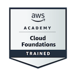

<h1 align="center">¡Hola! Soy Pau </h1>

<h3 align="center">Estudiante de DAW y DAM · Valencia, España</h3>

## 👨‍💻 Sobre mí

Actualmente estoy cursando segundo curso de Desarrollo de Aplicaciones Web (DAW) y Desarrollo de Aplicaciones Multiplataforma (DAM).

Me apasiona crear soluciones digitales útiles, funcionales y cuidadas visualmente. Estoy en aprendizaje continuo y disfruto especialmente del desarrollo full-stack, combinando el diseño de interfaces con la lógica necesaria para transformar una idea en un producto real.

- 🎓 Estudiante de 2.º de DAW y 2.º de DAM
- ☁️ Certificado en AWS Cloud Foundations
- 📍 Resido en Valencia, España

---

## 🛠️ Tecnologías y herramientas

  
  
  
  
  
  
  
   
  
  
  
  
  
  
   
  
  

---

## 📊 Estadísticas de GitHub

  
  

---

## 🏆 Certificaciones

  

